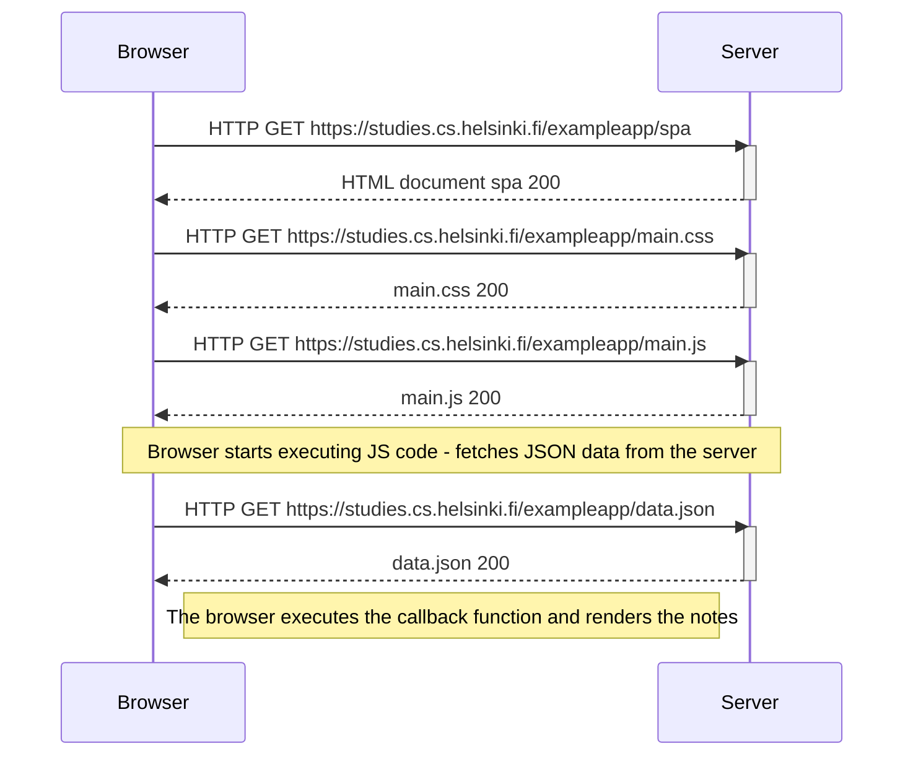
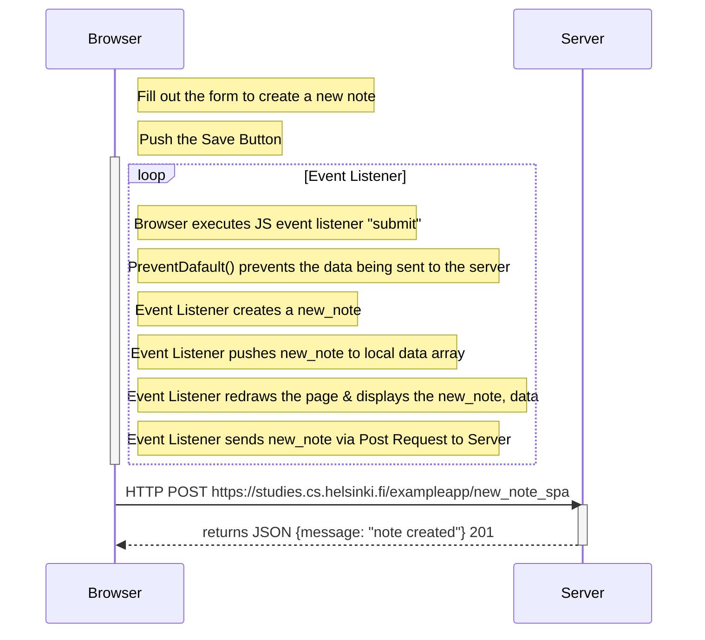

### Single Page Application

_Navigate to [https://studies.cs.helsinki.fi/exampleapp/spa](https://studies.cs.helsinki.fi/exampleapp/spa)_

#### Exercise 0.5

```mermaid
sequenceDiagram
    participant b as Browser
    participant s as Server

    b->>s: HTTP GET https://studies.cs.helsinki.fi/exampleapp/spa
    activate s
    s-->>b: HTML document spa 200
    deactivate s

    b->>s: HTTP GET https://studies.cs.helsinki.fi/exampleapp/main.css
    activate s
    s-->>b: main.css 200
    deactivate s

    b->>s: HTTP GET https://studies.cs.helsinki.fi/exampleapp/main.js
    activate s
    s-->>b: main.js 200
    deactivate s

    Note over b, s: Browser starts executing JS code - fetches JSON data from the server

    b->>s: HTTP GET https://studies.cs.helsinki.fi/exampleapp/data.json
    activate s
    s-->>b: data.json 200
    deactivate s

    Note right of b: The browser executes the callback function and renders the notes

```

_Add a New Note_

#### Exercise 0.6

```mermaid
sequenceDiagram
    participant b as Browser
    participant s as Server

    Note right of b: Fill out the form to create a new note
    note right of b: Push the Save Button

    activate b
    loop Event Listener
    Note right of b: Browser executes JS event listener "submit"
    Note right of b: PreventDafault() prevents the data being sent to the server
    Note right of b: Event Listener creates a new_note
    Note right of b: Event Listener pushes new_note to local data array

    Note right of b: Event Listener redraws the page & displays the new_note, data
    Note right of b: Event Listener sends new_note via Post Request to Server
    end
    deactivate b
    b->>s: HTTP POST https://studies.cs.helsinki.fi/exampleapp/new_note_spa
    activate s
    s-->>b: returns JSON {message: "note created"} 201
    deactivate s

```
