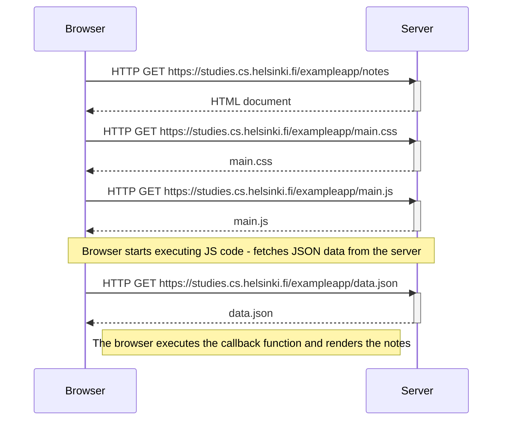
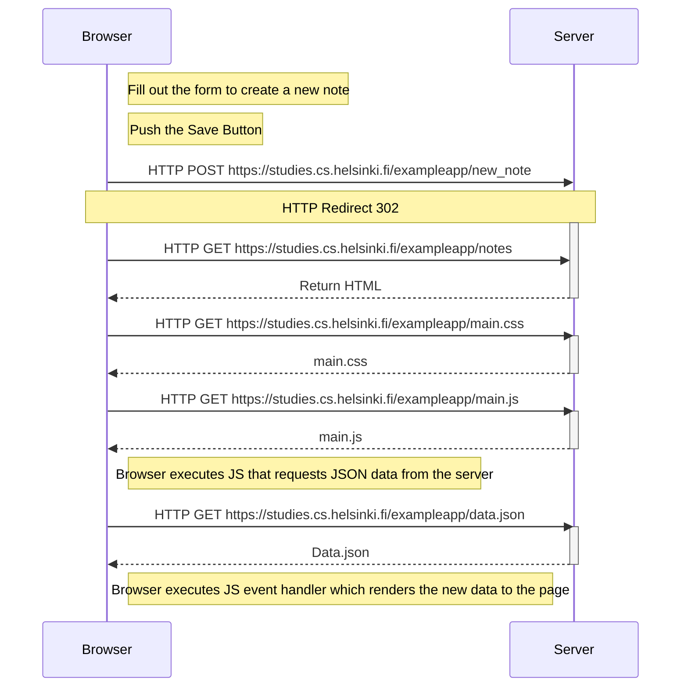

### Traditional Web

_Navigate to [https://studies.cs.helsinki.fi/exampleapp/notes](https://studies.cs.helsinki.fi/ezampleapp/notes)_

```mermaid
sequenceDiagram
    participant b as Browser
    participant s as Server


    b->>s: HTTP GET https://studies.cs.helsinki.fi/exampleapp/notes
    activate s
    s-->>b: HTML document
    deactivate s

    b->>s: HTTP GET https://studies.cs.helsinki.fi/exampleapp/main.css
    activate s
    s-->>b: main.css
    deactivate s

    b->>s: HTTP GET https://studies.cs.helsinki.fi/exampleapp/main.js
    activate s
    s-->>b: main.js
    deactivate s

    Note over b, s: Browser starts executing JS code - fetches JSON data from the server

    b->>s: HTTP GET https://studies.cs.helsinki.fi/exampleapp/data.json
    activate s
    s-->>b: data.json
    deactivate s

    Note right of b: The browser executes the callback function and renders the notes
```

_Fill out the form to create a new note_

#### Exercise 0.4

```mermaid
sequenceDiagram
    participant b as Browser
    participant s as Server

    Note right of b: Fill out the form to create a new note
    note right of b: Push the Save Button

    b->>s: HTTP POST https://studies.cs.helsinki.fi/exampleapp/new_note
    Note over b, s: HTTP Redirect 302
    activate s
    b->>s: HTTP GET https://studies.cs.helsinki.fi/exampleapp/notes
    s-->>b: Return HTML
    deactivate s

    b->>s: HTTP GET https://studies.cs.helsinki.fi/exampleapp/main.css
    activate s
    s-->>b: main.css
    deactivate s

    b->>s: HTTP GET https://studies.cs.helsinki.fi/exampleapp/main.js
    activate s
    s-->>b: main.js
    deactivate s

    Note right of b: Browser executes JS that requests JSON data from the server
    b->>s: HTTP GET https://studies.cs.helsinki.fi/exampleapp/data.json
    activate s
    s-->>b: Data.json
    deactivate s

    Note right of b: Browser executes JS event handler which renders the new data to the page

```
